# Design Document

## Overview

The Mystery Birthday Game is a progressive web application with a Disney Lotso-inspired theme that creates a unique birthday gift experience through discovery and puzzle-solving. The game begins by revealing it's a special birthday gift, then guides players through learning a mysterious communication system (Morse code) without explicitly naming it. Through Lotso's gentle hints and encouragement, players gradually discover they're learning dot-dash patterns that will ultimately reveal a personalized birthday message. The game embraces mystery, discovery, and Lotso's friendly personality while maintaining educational value through adorable animations, soft pastel colors, and encouraging guidance. All game instructions, hints, and guidance are provided in English to ensure clear communication and learning.

## Architecture

The application follows a modular, client-side architecture with clear separation of concerns, wrapped in a delightful Lotso-themed interface:

```mermaid
graph TB
    A[Game Controller 🧸] --> B[Morse Trainer 📚]
    A --> C[Challenge Engine 🎯]
    A --> D[Audio Manager 🔊]
    A --> E[Progress Tracker 📊]
    A --> F[UI Manager 🎨]
    A --> G[Theme Manager 🌸]
    
    B --> H[Morse Code Dictionary 📖]
    C --> H
    C --> I[Level Generator 🎲]
    D --> J[Web Audio API 🎵]
    E --> K[Local Storage 💾]
    F --> L[DOM Manipulation ✨]
    G --> M[Lotso Assets 🧸]
    
    N[Birthday Message 🎂] --> A
```



### Core Components

- **Game Controller**: Central orchestrator managing game flow with Lotso as the friendly guide
- **Morse Trainer**: Handles learning mode with Lotso teaching Morse code in his gentle, encouraging way
- **Challenge Engine**: Generates progressive challenges with cute animations and Lotso's supportive feedback
- **Audio Manager**: Manages Morse code audio with soft, pleasant tones matching the cute theme
- **Progress Tracker**: Handles game state persistence with adorable progress indicators
- **UI Manager**: Manages all user interface updates with smooth, delightful animations
- **Theme Manager**: Handles Lotso-themed visual elements, colors, and character animations

## Components and Interfaces

### Game Controller
```typescript
interface GameController {
  startGame(): void
  nextLevel(): void
  resetGame(): void
  showBirthdayMessage(): void
  getCurrentState(): GameState
}

interface GameState {
  currentLevel: number
  score: number
  completedLevels: string[]
  birthdayMessageUnlocked: boolean
}
```

### Morse Trainer
```typescript
interface MorseTrainer {
  showReferenceChart(): void
  playMorseCode(text: string, speed: PlaybackSpeed): void
  validateInput(input: string, expected: string): boolean
  getPracticeChallenge(): Challenge
}

enum PlaybackSpeed {
  SLOW = 10,    // 10 WPM
  NORMAL = 20,  // 20 WPM
  FAST = 30     // 30 WPM
}
```

### Challenge Engine
```typescript
interface ChallengeEngine {
  generateChallenge(level: number): Challenge
  validateAnswer(challenge: Challenge, answer: string): ValidationResult
  getNextLevel(currentLevel: number): number
}

interface Challenge {
  id: string
  level: number
  type: ChallengeType
  morseCode: string
  expectedAnswer: string
  hint?: string
}

enum ChallengeType {
  SINGLE_LETTER,
  SHORT_WORD,
  SENTENCE,
  BIRTHDAY_MESSAGE
}
```

### Audio Manager
```typescript
interface AudioManager {
  playDot(): void
  playDash(): void
  playMorseSequence(sequence: string, speed: PlaybackSpeed): void
  playLotsoSound(soundType: LotsoSoundType): void
  setVolume(volume: number): void
  mute(): void
  unmute(): void
}

enum LotsoSoundType {
  WELCOME = 'welcome',
  CORRECT = 'correct',
  WRONG = 'wrong',
  CELEBRATION = 'celebration',
  BIRTHDAY = 'birthday'
}
```

### Theme Manager
```typescript
interface ThemeManager {
  showLotsoAnimation(type: AnimationType): void
  playEncouragingMessage(): void
  updateProgressWithCelebration(progress: number): void
  showBirthdayAnimation(): void
}

enum AnimationType {
  WELCOME,
  CORRECT_ANSWER,
  WRONG_ANSWER,
  LEVEL_COMPLETE,
  BIRTHDAY_REVEAL
}
```

### Visual Design System
```typescript
interface LotsoTheme {
  colors: {
    primary: '#FF69B4',      // Lotso pink
    secondary: '#FFB6C1',    // Light pink
    accent: '#FF1493',       // Deep pink
    background: '#FFF0F5',   // Lavender blush
    text: '#8B4513',         // Saddle brown
    success: '#98FB98',      // Pale green
    warning: '#FFE4B5'       // Moccasin
  }
  fonts: {
    primary: 'Comic Sans MS, cursive',
    secondary: 'Arial, sans-serif'
  }
  animations: {
    bounce: 'bounce 0.6s ease-in-out',
    wiggle: 'wiggle 0.5s ease-in-out',
    sparkle: 'sparkle 1s infinite'
  }
}
```

## Data Models

### Morse Code Dictionary
```typescript
const MORSE_CODE_MAP: Record<string, string> = {
  'A': '.-',    'B': '-...',  'C': '-.-.',  'D': '-..',   'E': '.',
  'F': '..-.',  'G': '--.',   'H': '....',  'I': '..',    'J': '.---',
  'K': '-.-',   'L': '.-..',  'M': '--',    'N': '-.',    'O': '---',
  'P': '.--.',  'Q': '--.-',  'R': '.-.',   'S': '...',   'T': '-',
  'U': '..-',   'V': '...-',  'W': '.--',   'X': '-..-',  'Y': '-.--',
  'Z': '--..',  '0': '-----', '1': '.----', '2': '..---', '3': '...--',
  '4': '....-', '5': '.....', '6': '-....', '7': '--...', '8': '---..',
  '9': '----.', ' ': '/'
};
```

### Level Configuration
```typescript
interface LevelConfig {
  level: number
  name: string
  description: string
  challengeCount: number
  challengeType: ChallengeType
  passingScore: number
  timeLimit?: number
  lotsoMessage: string
  celebrationAnimation: AnimationType
  hints: string[]
  instructions: string
}

const LEVEL_CONFIGS: LevelConfig[] = [
  {
    level: 1,
    name: "Secret Patterns",
    description: "Let's learn some mysterious sound patterns! 🧸",
    challengeCount: 10,
    challengeType: ChallengeType.SINGLE_LETTER,
    passingScore: 80,
    lotsoMessage: "Great job! You're learning the secret code patterns!",
    celebrationAnimation: AnimationType.CORRECT_ANSWER,
    hints: [
      "Listen to the dots and dashes - each letter has its own sound!",
      "Short beeps are dots (.), long beeps are dashes (-)",
      "This is like learning a musical pattern for each letter!"
    ],
    instructions: "Click on the letters below to hear their secret sound patterns, then decode the mystery!"
  },
  {
    level: 2,
    name: "Pattern Words",
    description: "Now let's try combining patterns into words! 🍓",
    challengeCount: 8,
    challengeType: ChallengeType.SHORT_WORD,
    passingScore: 75,
    lotsoMessage: "Amazing! You're becoming a real pattern detective!",
    celebrationAnimation: AnimationType.LEVEL_COMPLETE,
    hints: [
      "Words are made by putting letter patterns together with spaces",
      "Take your time - there's no rush to solve the mystery!",
      "Remember the sound patterns you learned before"
    ],
    instructions: "Listen to the pattern sequence and figure out what word it spells!"
  },
  {
    level: 3,
    name: "Secret Messages",
    description: "Ready for complete secret messages? 🎁",
    challengeCount: 5,
    challengeType: ChallengeType.SENTENCE,
    passingScore: 70,
    lotsoMessage: "Incredible! You've almost mastered the secret code!",
    celebrationAnimation: AnimationType.LEVEL_COMPLETE,
    hints: [
      "These are full sentences in the secret pattern language!",
      "Listen for the spaces between words",
      "You're so close to discovering the big surprise!"
    ],
    instructions: "Decode this complete secret message - you're almost ready for your birthday surprise!"
  }
  // ... more levels building up to the revelation
];
```

### Game Text and Messaging
```typescript
interface GameMessages {
  welcome: string
  instructions: string
  hints: string[]
  encouragement: string[]
  corrections: string[]
  celebrations: string[]
}

const ENGLISH_MESSAGES: GameMessages = {
  welcome: "🎂 Surprise! I'm Lotso, and I have a very special birthday gift for you! But first, you'll need to learn a secret way of communicating...",
  instructions: "I'm going to teach you about dots (.) and dashes (-). Each letter has its own special pattern of sounds. Listen carefully!",
  hints: [
    "These dot and dash patterns are like a secret code!",
    "Short sounds are dots (.), long sounds are dashes (-)",
    "Each letter has its own unique sound pattern - try to remember them!",
    "This special code has been used for over 100 years to send messages!",
    "Don't worry if it seems tricky - you're learning something really cool!"
  ],
  encouragement: [
    "You're getting the hang of this secret code!",
    "That's it! You're becoming a code expert!",
    "Wow, you're really good at this pattern game!",
    "I'm so proud of how you're learning!",
    "You're going to love the surprise at the end!"
  ],
  corrections: [
    "Oops! Let me play that pattern again for you.",
    "No worries! This code takes practice to learn.",
    "Close! Here's the right pattern - listen carefully!",
    "Don't give up! You're doing better than you think!"
  ],
  celebrations: [
    "Perfect! You decoded that pattern!",
    "Fantastic work, detective!",
    "You're a pattern-solving star!",
    "That was exactly right! I'm so happy!"
  ]
};
```

### Birthday Message Configuration
```typescript
interface BirthdayConfig {
  recipientName: string
  personalMessage: string
  senderName: string
  celebrationDate: string
  lotsoPersonalizedMessage: string
  specialAnimation: boolean
}

const BIRTHDAY_MESSAGES = {
  intro: "🎂 You've learned the secret code! Now for your special birthday surprise! 🎁",
  decoding: "This final message contains your birthday gift - listen very carefully...",
  success: "🎉 Happy Birthday! You solved the mystery and learned Morse code! 🎉",
  lotsoWishes: "Surprise! You just learned Morse code - a real secret communication system! Your friend wanted to give you this amazing skill as a birthday gift! 🤗",
  instructions: "This is it - the final secret message! Decode this special pattern to reveal your birthday surprise!",
  hints: [
    "This message is longer than the others - take your time!",
    "Remember all the dot and dash patterns you've learned",
    "Every sound is important for this special birthday message",
    "You've become a real Morse code expert!"
  ],
  revelation: "The secret code you learned is called 'Morse Code' - invented over 150 years ago! You're now part of a special group of people who know this amazing skill!"
};
```

## User Experience Flow

### Language and Communication
All game content, instructions, hints, and feedback are provided exclusively in English to ensure clear communication and effective learning. This includes:
- Lotso's spoken and written messages
- Game instructions and tutorials
- Hint systems and help text
- Error messages and corrections
- Celebration and encouragement messages
- Birthday message content and presentation

### 1. Welcome Screen
- Lotso appears with a bouncing animation and birthday surprise announcement
- "🎂 Surprise! I'm Lotso, and I have a very special birthday gift for you!"
- "But first, you'll need to learn a secret way of communicating..."
- Mysterious and exciting tone without mentioning Morse code
- Soft pink gradient background with floating strawberry particles

### 2. Learning Phase
- Interactive pattern chart with English labels but no "Morse code" mention
- Lotso provides English explanations: "This letter makes this special sound pattern..."
- English instructions: "Click on any letter to hear its secret sound pattern"
- Helpful English hints: "Short sounds are dots, long sounds are dashes"
- Progress bar showing "Secret Code Mastery" advancement

### 3. Challenge Phases
- English instructions referring to "pattern decoding" and "secret messages"
- Lotso provides English encouragement: "You're becoming a pattern expert!"
- English error messages: "Let me play that secret pattern again"
- English hints: "Remember: dots are short beeps, dashes are long beeps"
- Level completion: "You're getting closer to your birthday surprise!"

### 4. Birthday Revelation
- English introduction: "You've mastered the secret code! Time for your surprise!"
- Instructions: "Decode this final secret message to reveal your birthday gift"
- English hints: "This is the most important message - listen carefully!"
- Final revelation: "Surprise! You just learned Morse code - a real secret communication system!"
- English celebration: "Happy Birthday! Your friend gave you an amazing new skill!"

## Technical Implementation

### Internationalization Structure
```typescript
interface GameLocalization {
  language: 'en'  // Fixed to English
  messages: GameMessages
  ui: {
    buttons: {
      start: "Start Game"
      next: "Next Level"
      retry: "Try Again"
      hint: "Need a Hint?"
      reset: "Start Over"
      playAgain: "Play Again"
      volume: "Volume"
      mute: "Mute"
    }
    labels: {
      score: "Score"
      level: "Level"
      progress: "Progress"
      accuracy: "Accuracy"
      timeSpent: "Time Spent"
      morseCode: "Morse Code"
      yourAnswer: "Your Answer"
      correctAnswer: "Correct Answer"
    }
    instructions: {
      clickLetter: "Click on a letter to hear its Morse code"
      inputMorse: "Enter the Morse code using dots (.) and dashes (-)"
      listenCarefully: "Listen carefully to the audio pattern"
      useReference: "Use the reference chart if you need help"
    }
  }
}
```

### CSS Animations
```css
@keyframes lotso-bounce {
  0%, 20%, 50%, 80%, 100% { transform: translateY(0); }
  40% { transform: translateY(-20px); }
  60% { transform: translateY(-10px); }
}

@keyframes strawberry-float {
  0% { transform: translateY(0px) rotate(0deg); }
  50% { transform: translateY(-20px) rotate(180deg); }
  100% { transform: translateY(0px) rotate(360deg); }
}

@keyframes sparkle {
  0% { opacity: 0; transform: scale(0); }
  50% { opacity: 1; transform: scale(1); }
  100% { opacity: 0; transform: scale(0); }
}
```

## Correctness Properties

*A property is a characteristic or behavior that should hold true across all valid executions of a system—essentially, a formal statement about what the system should do. Properties serve as the bridge between human-readable specifications and machine-verifiable correctness guarantees.*

### Property Reflection

After analyzing the acceptance criteria, I identified several properties that can be consolidated to avoid redundancy:
- Input handling properties (keyboard, mouse, timing) can be combined into comprehensive input validation
- Feedback properties (correct/incorrect answers) can be unified into response validation
- Progress tracking properties can be consolidated into persistence validation
- Level progression properties can be combined into challenge generation validation

### Core Properties

**Property 1: Letter-to-Morse mapping consistency**
*For any* letter in the alphabet, clicking on that letter should always play the same corresponding Morse code audio pattern
**Validates: Requirements 1.2**

**Property 2: Morse-to-letter highlighting accuracy**
*For any* valid Morse code pattern, hovering over it should highlight the correct corresponding letter
**Validates: Requirements 1.3**

**Property 3: Level progression unlocking**
*For any* completed level, the next sequential level should become unlocked and accessible
**Validates: Requirements 2.1**

**Property 4: Challenge type consistency by level**
*For any* level, all generated challenges should match the expected challenge type (single letters for easy, short words for medium, sentences for advanced)
**Validates: Requirements 2.2, 2.3, 2.4**

**Property 5: Error handling with retry capability**
*For any* incorrect answer, the system should display the correct answer and provide a retry option
**Validates: Requirements 2.5**

**Property 6: Input method equivalence**
*For any* Morse code sequence, all input methods (keyboard, mouse, touch) should produce the same result when entering the same pattern
**Validates: Requirements 3.2, 3.3**

**Property 7: Character separation timing**
*For any* sequence of Morse code inputs with pauses, characters should be automatically separated based on timing thresholds
**Validates: Requirements 3.4**

**Property 8: Birthday message customization**
*For any* valid name and personal message configuration, the final birthday message should include both the specified name and personal message
**Validates: Requirements 4.4**

**Property 9: Feedback consistency**
*For any* player response, correct answers should always trigger positive feedback and incorrect answers should always trigger gentle correction
**Validates: Requirements 5.2, 5.3**

**Property 10: Progress persistence**
*For any* level completion, the achievement should be saved to local storage and restored on subsequent game sessions
**Validates: Requirements 6.1, 6.2**

**Property 11: Responsive design adaptation**
*For any* screen size, the game interface should maintain usable controls and readable text
**Validates: Requirements 7.2**

## Error Handling

### Input Validation
- Invalid Morse code sequences trigger gentle correction with Lotso's encouraging guidance
- Malformed birthday message configurations default to generic friendly messages
- Audio playback failures fall back to visual-only Morse code representation

### State Management
- Corrupted local storage data triggers fresh game initialization
- Network connectivity issues for audio assets provide offline fallback sounds
- Browser compatibility issues gracefully degrade to basic functionality

### User Experience
- Long periods of inactivity show Lotso providing helpful hints
- Repeated failures trigger additional learning resources and encouragement
- Technical errors display user-friendly messages with Lotso's apology and retry options

## Testing Strategy

### Dual Testing Approach
The system will use both unit tests and property-based tests for comprehensive coverage:

**Unit Tests**: Focus on specific examples, edge cases, and integration points
- Game initialization and welcome screen display
- Specific Morse code patterns and their audio/visual representations
- Birthday message revelation sequence
- Mobile touch controls and accessibility features
- Error conditions and fallback behaviors

**Property-Based Tests**: Verify universal properties across all inputs with minimum 100 iterations each
- Morse code mapping consistency across the entire alphabet
- Input method equivalence across different interaction types
- Level progression logic across all difficulty levels
- Progress persistence across browser sessions
- Responsive design behavior across screen size ranges

**Property Test Configuration**:
- Each property test runs minimum 100 iterations due to randomization
- Tests tagged with format: **Feature: morse-code-birthday-game, Property {number}: {property_text}**
- Property-based testing library: fast-check for JavaScript/TypeScript
- Unit testing framework: Jest with DOM testing utilities

### Lotso-Themed Testing
- Visual regression tests ensure Lotso animations and theme consistency
- Audio tests verify pleasant tone quality and Lotso voice clip integration
- User experience tests validate the cute, encouraging interaction flow
- Accessibility tests ensure the theme doesn't compromise usability

<function_calls>
<invoke name="prework">
<parameter name="featureName">morse-code-birthday-game